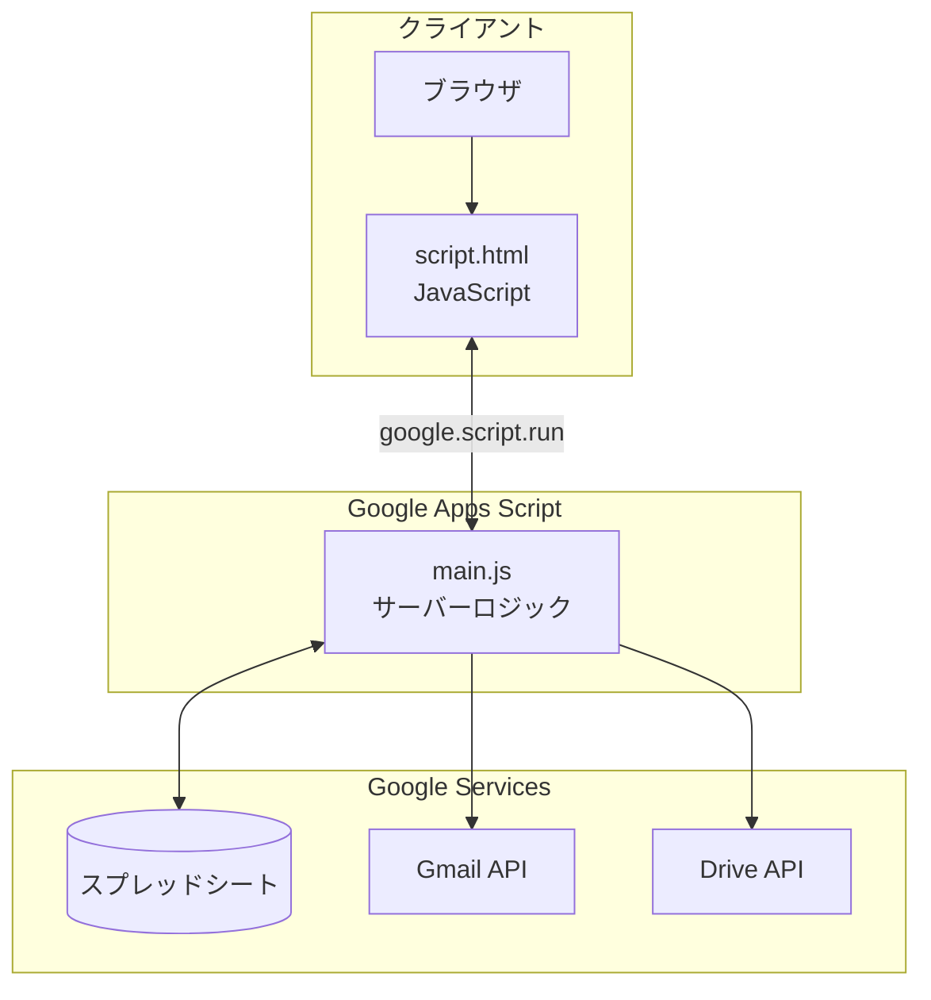
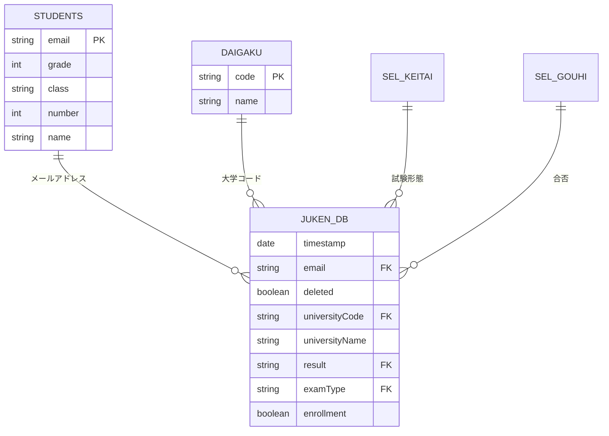
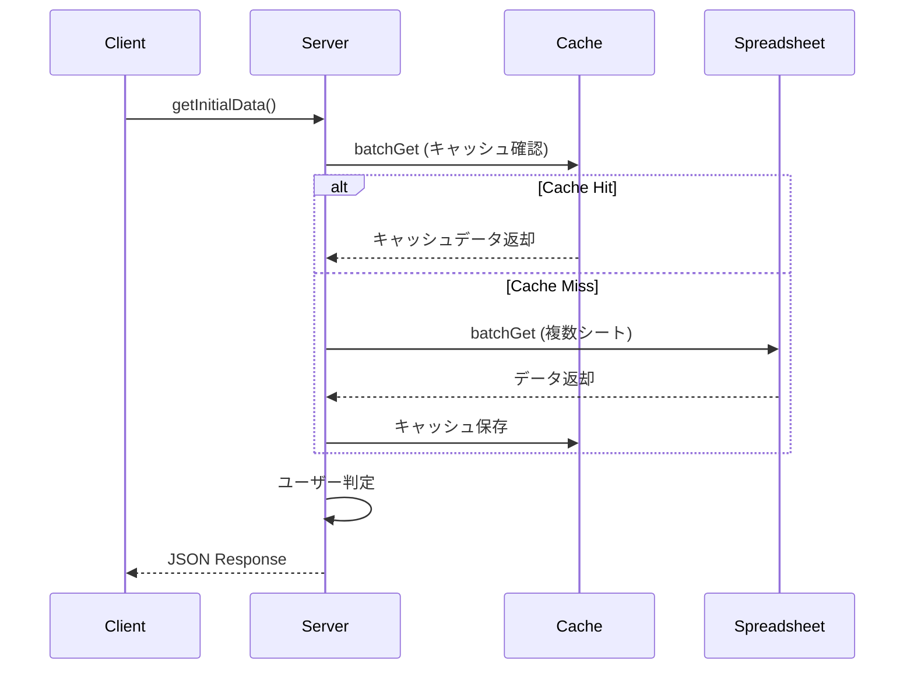
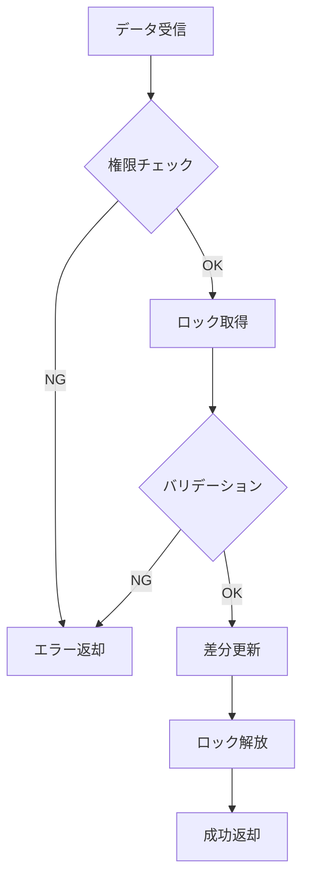
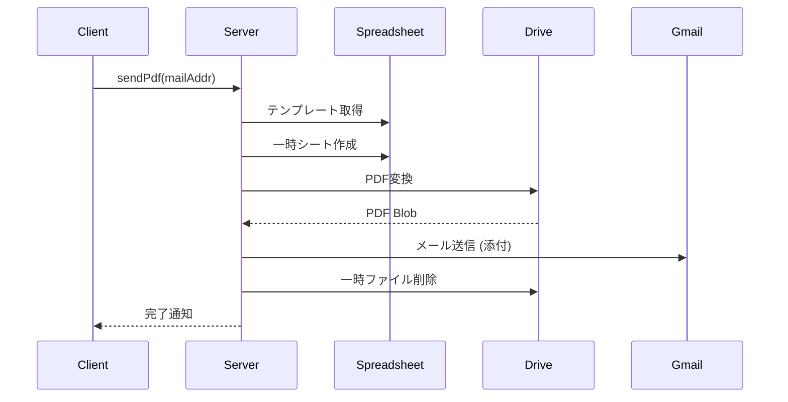
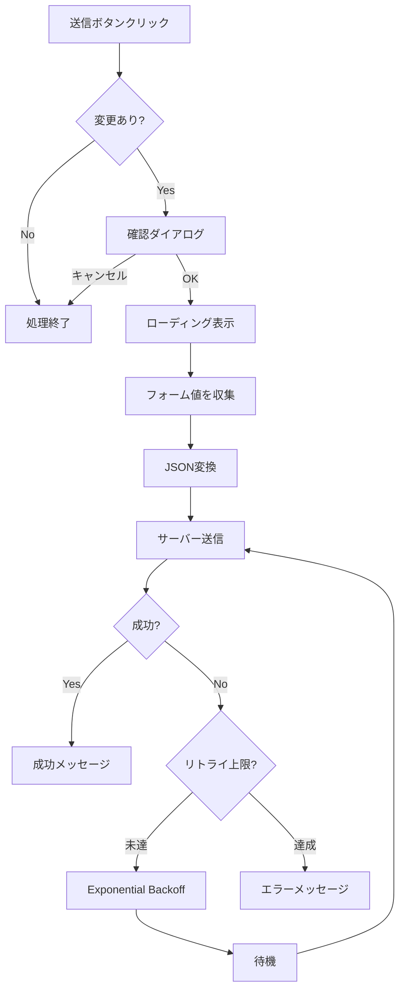

# プログラム仕様書

[](./VERSION_CHANGES.md)
[](https://developers.google.com/apps-script)
[](#)

> 本ドキュメントは、受験校調査アプリの技術仕様を記載した開発者向けリファレンスです。

---

## 📖 目次

- [システム概要](#1-システム概要)
- [ファイル構成](#2-ファイル構成)
- [スプレッドシート構造](#3-スプレッドシート構造)
- [サーバーサイド仕様](#4-サーバーサイド仕様)
- [クライアントサイド仕様](#5-クライアントサイド仕様)
- [セキュリティと権限](#6-セキュリティと権限)
- [API リファレンス](#7-api-リファレンス)

---

## 1. システム概要

### アーキテクチャ



### 技術スタック

| レイヤー | 技術 |
|:---|:---|
| フロントエンド | HTML5, CSS3, Vanilla JavaScript |
| バックエンド | Google Apps Script (V8 Runtime) |
| データベース | Google Spreadsheet |
| 認証 | Google OAuth 2.0 |

---

## 2. ファイル構成

```
juken-survey/
├── main.js              # サーバーサイド処理 (GAS)
├── index.html           # メイン画面レイアウト
├── css.html             # スタイルシート (CSS)
├── script.html          # クライアントサイド処理
└── appsscript.json      # マニフェストファイル
```

### ファイル詳細

| ファイル | 役割 | 備考 |
|:---|:---|:---|
| `main.js` | サーバーサイド処理 | API, DB操作, メール送信 |
| `index.html` | メイン画面レイアウト | HTML構造, 静的コンテンツ |
| `css.html` | スタイルシート | CSS変数, レスポンシブ対応 |
| `script.html` | クライアントサイド処理 | UI操作, 非同期通信, バリデーション |
| `appsscript.json` | プロジェクト設定 | マニフェストファイル |

---

## 3. スプレッドシート構造

システムは単一のスプレッドシートでデータベースと設定を管理します。

### 3.1 シート一覧

| シート名 | 定数名 | 用途 |
|:---|:---|:---|
| **学籍データ** | `STUDENTS` | 生徒マスタ |
| **職員データ** | `TEACHERS` | 教員マスタ |
| **受験校DB** | `JUKEN_DB` | トランザクションデータ |
| **大学データ** | `DAIGAKU` | 大学コードマスタ |
| **試験形態** | `SEL_KEITAI` | 選択肢マスタ |
| **合否選択肢** | `SEL_GOUHI` | 選択肢マスタ |
| **設定** | `SETTINGS` | システム設定 |
| **調査書交付願** | `PDF_TEMPLATE` | 帳票テンプレート |
| **校内DB用** | `KOUNAI_DB` | エクスポート用 |

### 3.2 主要シートのカラム定義

#### 学籍データ (`STUDENTS`)

| 列 | カラム名 | 型 | 必須 |
|:---:|:---|:---|:---:|
| A | メールアドレス | String | ✅ |
| B | 学年 | Number | ✅ |
| C | クラス | String | ✅ |
| D | 出席番号 | Number | ✅ |
| E | 氏名 | String | ✅ |

#### 受験校DB (`JUKEN_DB`)

| 列 | カラム名 | 型 | 備考 |
|:---:|:---|:---|:---|
| A | タイムスタンプ | Date | 自動設定 |
| B | メールアドレス | String | 学籍データと紐付け |
| C | 削除フラグ | Boolean | 論理削除用 |
| D | 大学コード | String | 大学データと紐付け |
| E | 大学名 | String | |
| F | 合否 | String | 選択肢マスタ参照 |
| G | 受験形態 | String | 選択肢マスタ参照 |
| H | 進学 | Boolean | |

### 3.3 ER図



---

## 4. サーバーサイド仕様

> **ファイル**: `main.js`

### 4.1 エントリポイント・初期化

#### `doGet(e)`

Webアプリへのアクセス時に呼び出されるエントリポイント。

```javascript
function doGet(e) {
  const settings = getSettings();
  const htmlTemplate = HtmlService.createTemplateFromFile('index');
  const html = htmlTemplate.evaluate();
  html.setTitle(settings.pageTitle);
  return html;
}
```

| 項目 | 内容 |
|:---|:---|
| **戻り値** | `HtmlOutput` |
| **タイトル設定** | 設定シートから動的に取得 |
| **セキュリティ** | デフォルト設定 |

---

#### `getInitialData()`

クライアント起動時に必要なデータを一括取得。



| 項目 | 内容 |
|:---|:---|
| **戻り値** | `Object` (ユーザーロールに応じたJSON) |
| **取得内容** | 選択肢マスタ, ユーザー情報, 設定値 |
| **ユーザーロール** | `student` / `teacher` / `guest` |
| **キャッシュ対応** | 設定・マスタデータはキャッシュ利用 |

---

### 4.2 データ操作

#### `sendExamData(strJuken, mailAddr)`

受験データを保存する。

| パラメータ | 型 | 説明 |
|:---|:---|:---|
| `strJuken` | `String` | JSON文字列 (受験データ配列) |
| `mailAddr` | `String` | 対象のメールアドレス |

**処理フロー:**



| 機能 | 説明 |
|:---|:---|
| **排他制御** | `LockService` で同時書き込みを防止 |
| **バリデーション** | 入力件数、選択肢の正当性チェック |
| **更新方式** | 差分更新（変更行のみ） |
| **削除方式** | 論理削除（削除フラグ） |
| **リトライ機能** | クライアント側でExponential Backoff対応 |

---

#### `getExamDataList(mailAddr)`

指定されたメールアドレスの受験データを取得。

| パラメータ | 型 | 説明 |
|:---|:---|:---|
| `mailAddr` | `String` | 対象のメールアドレス |

| 項目 | 内容 |
|:---|:---|
| **戻り値** | `Array` (受験データ配列) |
| **フィルタ** | 削除フラグ `TRUE` のデータは除外 |

---

### 4.3 帳票・メール

#### `sendPdf(mailAddr)`

調査書交付願PDFを生成してメール送信。



---

### 4.4 管理・ユーティリティ

| 関数名 | 説明 |
|:---|:---|
| `createData()` | 校内DB用データを生成 |
| `importUniversityData()` | Benesseデータをインポート |
| `getUniversityDataList()` | 大学コードマスタを取得（gzip圧縮対応） |
| `getSheetDataApiWithCache(sheetName)` | シートデータを取得してキャッシュ |
| `getBatchSheetDataWithCache(requests)` | 複数シートを一括取得（キャッシュ対応）|
| `warmUpCache(sheetName)` | 指定シートのキャッシュを更新 |
| `warmUpAllCache()` | 全キャッシュを一括更新 |
| `setupTriggers()` | キャッシュ更新トリガーを設定 |
| `queryDeleteMarkedRows()` | 論理削除済みデータを完全削除 |
| `clearUniversityData()` | 大学データをクリア |
| `incrementUniversitySerial()` | 大学データ変更時にシリアル番号を自動インクリメント |

---

## 5. クライアントサイド仕様

> **ファイル**: `script.html`

### 5.1 初期化・状態管理

#### `pageLoaded()`

ページ読み込み時の初期化処理。

```javascript
function pageLoaded() {
  cacheDomElements();
  window.onbeforeunload = null;
  setDialogSpinner(" 初期データ取得中・・・");
  setElementHidden(dom.selectorSection, true)
  setElementHidden(dom.inputSection, true)
  showProgressDialog(true);
  google.script.run
    .withSuccessHandler(onInitialDataReceived)
    .withFailureHandler(error => {
      console.error(error);
      showProgressDialog(false);
      confirmAsync("エラー", "処理に失敗しました。<br>時間をおいて再度試すか、先生に連絡してください。<br>詳細: " + error.message);
    })
    .getInitialData();
}
```

#### `cacheDomElements()`

頻繁にアクセスするDOM要素をキャッシュ。

| グローバル変数 | 型 | 用途 |
|:---|:---|:---|
| `dom` | `Object` | DOM要素の参照を格納 |

---

### 5.2 UI操作

#### `setInputTable()`

受験データに基づき入力フォームを動的生成。

| 特徴 | 説明 |
|:---|:---|
| **テンプレート使用** | `<template id="examRowTemplate">` |
| **パフォーマンス** | DOM生成コストを低減 |

---

#### 大学検索機能

| 関数 | 説明 |
|:---|:---|
| `searchUniversityCode(row)` | 検索ダイアログを表示 |
| `searchKeyword()` | インクリメンタルサーチを実行 |
| `getUniversityDataList()` | 大学データを取得（gzip圧縮対応） |

**キャッシュ仕様:**

| 項目 | 内容 |
|:---|:---|
| 保存先 | `localStorage` |
| キー | `universityDataCache`, `universityDataTimestamp`, `universityCodeSerial` |
| 有効期限 | 24時間 |
| 圧縮形式 | gzip（サーバー側） |
| データ形式 | Base64エンコード |

---

### 5.3 データ送信

#### `sendExamDataWithRetry()`

フォームの入力値をサーバーに送信（リトライ機能付き）。



---

## 6. セキュリティと権限

### 認証・認可

| 項目 | 説明 |
|:---|:---|
| **認証** | Google OAuth 2.0 |
| **ユーザー識別** | `Session.getActiveUser().getEmail()` |
| **権限チェック** | `isValidUser()` 関数 |

### アクセス制御マトリクス

| 操作 | 生徒 | 教員 | ゲスト |
|:---|:---:|:---:|:---:|
| 自分のデータ閲覧 | ✅ | ✅ | ❌ |
| 自分のデータ編集 | ✅ | ✅ | ❌ |
| 他生徒のデータ閲覧 | ❌ | ✅ | ❌ |
| 他生徒のデータ編集 | ❌ | ✅ | ❌ |
| PDF発行 | ✅ | ✅ | ❌ |

---

## 7. API リファレンス

### クライアント → サーバー

| 関数名 | 引数 | 戻り値 | 説明 |
|:---|:---|:---|:---|
| `getInitialData()` | なし | `Object` | 初期データ取得 |
| `getStudentsList()` | なし | `Array` | 生徒一覧取得（教員用） |
| `getExamDataList(mailAddr)` | `String` | `Array` | 受験データ取得 |
| `sendExamData(strJuken, mailAddr)` | `String`, `String` | `Object` | 受験データ保存 |
| `sendPdf(mailAddr)` | `String` | `Object` | PDF発行 |
| `getUniversityDataList()` | なし | `String` | 大学データ取得（gzip圧縮）|

### レスポンス形式

```javascript
// 成功時
{
  "success": true,
  "message": "保存しました",
  "data": { ... }
}

// エラー時
{
  "success": false,
  "message": "エラーメッセージ",
  "error": "詳細情報"
}
```

---

<div align="center">

📚 **関連ドキュメント**

[README](./README.md) ｜ [変更履歴](./VERSION_CHANGES.md) ｜ [教員マニュアル](./TEACHER_MANUAL.md)

</div>
