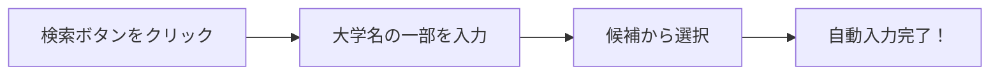

# 生徒用マニュアル

[](./VERSION_CHANGES.md)
[](#)

> このアプリは、みなさんの大学受験状況（受験予定校・合否結果）を学校に提出し、調査書の発行を依頼するためのシステムです。

---

## 📖 目次

- [はじめに](#1-はじめに)
- [アプリの使い方](#2-アプリの使い方)
- [調査書の発行依頼](#3-調査書の発行依頼)
- [注意事項](#4-注意事項)
- [困ったときは（FAQ）](#5-困ったときはfaq)

---

## 1. はじめに

### 💻 推奨環境

| 項目 | 推奨 |
|:---|:---|
| ブラウザ | **Google Chrome**（最新版） |
| デバイス | PC、タブレット、スマートフォン |
| アカウント | 学校から配布されたGoogleアカウント |

> [!IMPORTANT]
> 必ず**学校から配布されたGoogleアカウント**でログインしてください。個人のアカウントではアクセスできません。

### ⚡ システムの特徴（v2.3.0）

このシステムは高速に動作するよう最適化されています：

- **初回アクセス時**: データ読み込みに数秒かかります
- **2回目以降**: キャッシュ機能により高速に表示されます
- **データ保存**: すぐに反映され、他のデバイスからも確認できます

---

## 2. アプリの使い方

### 2.1 📱 画面へのアクセス

```
1. 先生から連絡されたURLにアクセス
2. Googleアカウントでログイン
3. 自分の氏名が表示されていることを確認
```

> [!TIP]
> 表示されている名前が自分のものか必ず確認してください！

---

### 2.2 ✏️ 受験校の追加・修正

画面上の表に、以下のルールに従って入力してください。

#### 入力項目一覧

| 項目 | 入力方法 |
|:---|:---|
| **大学CD** | 直接入力 or 🔍検索ボタンで選択 |
| **大学名・学部** | 検索時は自動入力 / 手動修正も可能 |
| **試験形態** | プルダウンから選択（一般、共テ利用、総合型など） |
| **合否** | 結果判明後にプルダウンで選択 |
| **進学** | 進学先が決まったらラジオボタンで選択 |
| **削除** | 🗑️ ボタンをクリックして削除マーク |

#### 🔍 大学検索の使い方



**例**: 「東京」と入力すると...
- 東京大
- 東京工大
- 東京理大

などが候補として表示されます。

> [!NOTE]
> **初回の検索時は少し時間がかかる場合があります**が、2回目以降は高速に表示されます（キャッシュ機能により24時間保存されます）。

#### 🚀 検索のコツ

| やり方 | 説明 |
|:---|:---|
| **複数キーワード** | 「東京 理」のようにスペースで区切って検索できます |
| **学部名で検索** | 「経済」「工」などの学部名でも検索できます |
| **大学コード直接入力** | コードがわかっている場合は直接入力も可能 |

---

### 2.3 💾 送信（保存）

> [!CAUTION]
> **ボタンを押すまでデータは保存されません！**

入力や修正が終わったら、必ず画面下にある「**送信**」ボタンを押してください。

```
✅ こまめに送信することをお勧めします
✅ 送信が成功すると確認メッセージが表示されます
✅ 保存されたデータは即座にサーバーに反映されます
```

#### 送信時の表示

| 表示 | 意味 |
|:---|:---|
| 「変更有→」 | 未保存の変更があります |
| ローディング表示 | データ送信中です |
| 成功メッセージ | 保存が完了しました |

---

### 2.4 志望校の表示順序について

すでに入力されている大学コードを他の大学コードに入れ替えた場合、保存すると順序が入れ替わります。

| 保存前 | 保存後 | 説明 |
|:---|:---|:---|
| 大学A | 大学A | |
| 大学B | 大学B | |
| 大学C → 大学Hに変更 | 大学D | 大学Cが削除され以降の大学が上に詰められる |
| 大学D | 大学E | |
| 大学E | 大学F | |
| 大学F | 大学G | |
| 大学G | 大学H | 変更した大学が最後に追加される |

> [!TIP]
> 志望順位を変えたい場合は、一度削除してから正しい順序で入力し直すとスムーズです。

---

## 3. 調査書の発行依頼

受験する大学が決まったら、調査書の発行をシステムから依頼できます。

### 発行手順

| ステップ | 操作 |
|:---:|:---|
| ① | 必要な受験校データをすべて入力 |
| ② | 「**送信**」ボタンで保存を完了 |
| ③ | 「**調査書発行願作成**」ボタンをクリック |
| ④ | 確認ダイアログで「はい」を選択 |
| ⑤ | PDFが自動生成され、メールで送信される |

### 📧 送信先

- **自分のメールアドレス**（確認用）
- **担任の先生**

> [!TIP]
> メールが届いているか必ず確認してください。届かない場合は迷惑メールフォルダも確認しましょう。

### 📄 PDFの内容

調査書交付願のPDFには以下の情報が含まれます：

- あなたの氏名・クラス・出席番号
- 入力した受験校の情報
- 大学コード・学部学科名
- 試験形態
- 出願締切日・試験日

---

## 4. 注意事項

### ⚠️ 重要なポイント

| 項目 | 説明 |
|:---|:---|
| 🎓 **進学先の決定** | 進学する大学が決まったら、必ずその大学の「進学」欄を選択して送信 |
| 📅 **入力期間** | 先生から指示された期間内に入力を完了（期間外は入力不可になる場合あり） |
| 💾 **こまめな保存** | ブラウザを閉じる前に必ず「送信」ボタンを押す |
| 🔄 **複数デバイス対応** | PC・スマホどちらからでもアクセス可能（データは同期されます） |

### 🚫 やってはいけないこと

| ❌ NG | 理由 |
|:---|:---|
| 「送信」せずにブラウザを閉じる | データが保存されず、入力内容が消えます |
| 個人アカウントでログイン | アクセス権限がなくエラーになります |
| 友達のデータを見る・編集する | 他人のデータは閲覧・編集できません（教員のみ可能） |

---

## 5. 困ったときは（FAQ）

<details>
<summary><strong>Q. ログインできない</strong></summary>

**確認ポイント:**
1. 学校配布のGoogleアカウントでログインしていますか？
2. パスワードは正しいですか？
3. ブラウザがGoogle Chromeですか？

→ 解決しない場合は担任の先生に相談してください。
</details>

<details>
<summary><strong>Q. 入力した内容が消えた</strong></summary>

**原因:** 「送信」ボタンを押す前にブラウザを閉じた可能性があります。

**対策:** 入力後は必ず「送信」ボタンを押して保存してください。保存されると確認メッセージが表示されます。
</details>

<details>
<summary><strong>Q. 大学が検索で見つからない</strong></summary>

**対処法:**
1. 大学名の一部（例：「早稲田」「慶應」）で検索してみてください
2. 複数のキーワードで検索（例：「東京 理」）
3. それでも見つからない場合は、大学コードと大学名を手動で入力してください
4. 不明な場合は先生に確認してください
</details>

<details>
<summary><strong>Q. 「入力できません」と表示される</strong></summary>

**原因:** 入力期間外の可能性があります。

**対処法:** 担任の先生に入力期間について確認してください。

**別の原因:** システム管理者が入力を一時停止している可能性があります。
</details>

<details>
<summary><strong>Q. 間違えて削除してしまった</strong></summary>

**削除マークを付けただけの場合:**
「削除」ボタンをもう一度押すと「戻す」に変わり、復元できます。

**送信してしまった場合:**
担任の先生に連絡してください。教員モードで復元・再入力してもらえます。
</details>

<details>
<summary><strong>Q. 調査書発行願のメールが届かない</strong></summary>

**確認ポイント:**
1. 迷惑メールフォルダを確認
2. Gmailの「すべてのメール」を確認
3. しばらく待ってから再確認（数分かかる場合があります）
4. 自分のメールアドレスが正しく登録されているか確認

→ それでも届かない場合は担任の先生に連絡してください。
</details>

<details>
<summary><strong>Q. 初めて使うとき、画面が表示されるまで時間がかかる</strong></summary>

**これは正常な動作です！**

システムは初回アクセス時にデータを読み込んでキャッシュに保存します。2回目以降のアクセスは高速になります。

- 初回: 5〜10秒程度
- 2回目以降: 1〜2秒程度

辛抱強く待ってください。
</details>

<details>
<summary><strong>Q. 大学検索が初回だけ遅い</strong></summary>

**これは正常な動作です！**

大学データは初回検索時にダウンロードされ、あなたのブラウザに24時間保存されます（キャッシュ）。2回目以降は保存されたデータを使うため、瞬時に検索できます。
</details>

<details>
<summary><strong>Q. スマホでも使える？</strong></summary>

はい、使えます！

PC、タブレット、スマートフォンのどれでもアクセスできます。保存したデータはすべてのデバイスで同期されます。

ただし、入力作業はPCの方がやりやすいかもしれません。
</details>

<details>
<summary><strong>Q. 同じ大学を複数入力できる？</strong></summary>

**できません。**

同じ大学コードを入力すると、「○番と重複しています」というエラーメッセージが表示されます。

同じ大学の異なる学部・日程を入力したい場合は、それぞれ別の大学コードがあるはずです。先生に確認してください。
</details>

<details>
<summary><strong>Q. 先生は私のデータを見ることができる？</strong></summary>

はい、できます。

担任の先生（教員モード）は、すべての生徒のデータを閲覧・編集できます。これは、サポートやデータ確認のための機能です。
</details>

---

## 📞 お問い合わせ

操作方法が分からない場合やエラーが出る場合は、**担任の先生**に連絡してください。

以下の情報を伝えるとスムーズです：

- 何をしようとしていたか
- どんなエラーメッセージが出たか
- 使っているデバイス（PC / スマホ / タブレット）

---

<div align="center">

**頑張れ受験生！** 🎌

このシステムがみなさんの受験をサポートします。

---

*v2.3.0 - より高速に、より快適に*

</div>
