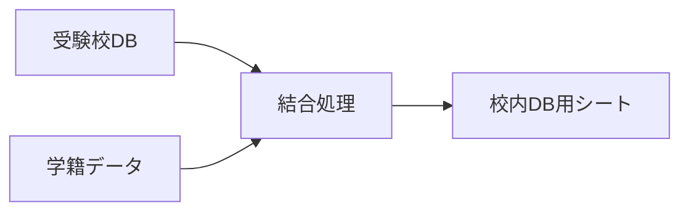

# 教員・管理者用マニュアル

[](./VERSION_CHANGES.md)
[](#)

> 本マニュアルは、受験校調査アプリの管理・運用を行う教員向けの説明書です。

---

## 📖 目次

- [ログイン・アクセス方法](#1-ログインアクセス方法)
- [Webアプリの操作（教員モード）](#2-webアプリの操作教員モード)
- [スプレッドシートの管理と設定](#3-スプレッドシートの管理と設定)
- [管理者用メニュー機能](#4-管理者用メニュー機能)
- [トラブルシューティング](#5-トラブルシューティング)
- [よくある質問（FAQ）](#6-よくある質問faq)

---

## 1. ログイン・アクセス方法

### アクセス手順

```
1. 配布されたWebアプリのURLにアクセス
2. Googleアカウントでログイン（学校指定アカウント）
3. 教員モードで画面が表示される
```

> [!IMPORTANT]
> 必ず「**職員データ**」シートに登録されているメールアドレスのアカウントでログインしてください。未登録の場合は権限エラーとなります。

---

## 2. Webアプリの操作（教員モード）

教員アカウントでアクセスすると、自動的に「**教員モード**」として画面が表示されます。

### 👨‍🎓 生徒データの確認・代理入力

| ステップ | 操作 | 説明 |
|:---:|:---|:---|
| ① | **クラス選択** | 画面上部のプルダウンから確認したいクラスを選択 |
| ② | **生徒選択** | 隣のプルダウンから生徒を選択（番号順） |
| ③ | **データ表示** | 選択した生徒の現在の登録状況が表示される |
| ④ | **代理入力** | 必要に応じてデータの追加・修正・削除が可能 |

> [!TIP]
> 変更を行った場合は、必ず画面下部の「**送信**」ボタンを押して保存してください。

> [!NOTE]
> **v2.3.3新機能**: 生徒選択リストで、受験校未登録の生徒は青色で表示されます。保存後は色分けが自動更新されるため、未入力者の確認が容易です。

---

## 3. スプレッドシートの管理と設定

スプレッドシート本体でマスタデータやシステム設定を管理します。

### 📊 マスタデータの管理

> [!CAUTION]
> **シート名の変更は絶対に行わないでください**。システムが正常に動作しなくなります。

#### 学籍データ

| 列 | 項目 | 備考 |
|:---:|:---|:---|
| A | メールアドレス | **必須・重複不可** |
| B | 学年 | |
| C | クラス | |
| D | 出席番号 | |
| E | 氏名 | |
| F | 登録数 | システム自動更新（手動でヘッダー追加が必要） |

#### 職員データ

| 列 | 項目 | 備考 |
|:---:|:---|:---|
| A | メールアドレス | **必須** - 未登録の教員はアクセス不可 |
| B | 氏名 | |

#### その他のマスタシート

| シート名 | 用途 |
|:---|:---|
| `大学データ` | 大学コードマスタ（Benesseインポート機能で作成可能） |
| `試験形態` | プルダウンに表示される試験形態リスト |
| `合否選択肢` | プルダウンに表示される合否結果リスト |

---

### ⚙️ システム設定（`設定`シート）

B列の値を変更することで動作を制御できます。

| 項目名 | 説明 | 設定例 |
|:---|:---|:---|
| **ページタイトル** | ブラウザタブ・ヘッダーに表示 | `2025年度 受験校調査` |
| **最大登録件数** | 生徒1人あたりの最大件数 | `20` |
| **入力許可** | 生徒の入力を制御 | `TRUE` / `FALSE` |
| **メール件名** | 調査書発行願のメール件名 | `[調査書発行願]` |
| **メール本文** | メール本文の定型文 | `調査書を添付します。印刷して提出してください。` |

---

## 4. 管理者用メニュー機能

スプレッドシート上部のメニューバー「**校内DB用**」から以下の機能を実行できます。

### 4.1 📤 校内DB用データ生成



| 項目 | 内容 |
|:---|:---|
| **機能** | `受験校DB` のデータに生徒情報と大学名を結合し、分析用形式で出力 |
| **用途** | 他システムへのデータ連携、Excel集計作業の前処理 |

---

### 4.2 🗑️ 削除レコード完全削除

| 項目 | 内容 |
|:---|:---|
| **機能** | アプリ上で「削除」されたデータ（論理削除状態）を完全消去 |
| **注意** | **実行後は復元不可** - 必ずバックアップを取得してから実行 |

> [!WARNING]
> この操作は取り消しできません。実行前にスプレッドシートのコピーを作成することを強く推奨します。

---

### 4.3 📥 Benesse大学データインポート

#### 事前準備（文字コード変換）

> [!IMPORTANT]
> BenesseのCSVファイルは **Shift_JIS** エンコードです。Googleスプレッドシートで文字化けを防ぐため、**UTF-8** に変換してください。

**変換手順:**

```
1. CSVファイルを「メモ帳」で開く
2. 「ファイル」→「名前を付けて保存」を選択
3. エンコードを「UTF-8」に変更して保存
```

#### インポート手順

| ステップ | 操作 |
|:---:|:---|
| ① | 新しいシートを作成 |
| ② | UTF-8変換済みCSVデータをA1セルから貼り付け |
| ③ | そのシートを開いた状態でメニューから本機能を実行 |
| ④ | `大学データ` シートが自動更新される |

---

### 4.4 🔄 大学データクリア

| 項目 | 内容 |
|:---|:---|
| **機能** | `大学データ` シートの内容を全消去（ヘッダーのみ残す） |
| **用途** | 新年度更新時のマスタリセット |

---

## 5. トラブルシューティング

### よくあるエラーと対処法

| 症状 | 原因 | 対処法 |
|:---|:---|:---|
| 「権限エラー」と表示される | 職員データに未登録 | `職員データ`シートにメールアドレスを追加 |
| 生徒が表示されない | 学籍データの問題 | `学籍データ`シートの内容を確認 |
| 大学検索で候補が出ない | 大学データが空 | Benesseデータをインポート |
| PDFが送信されない | メール設定の問題 | `設定`シートのメール関連項目を確認 |

---

## 6. よくある質問（FAQ）

<details>
<summary><strong>Q. 入力期間を制限するには？</strong></summary>

`設定`シートの「**入力許可**」を `FALSE` に変更してください。生徒はデータの閲覧のみ可能になります。

</details>

<details>
<summary><strong>Q. 生徒のデータを一括で確認したい</strong></summary>

「**校内DB用データ生成**」機能を実行すると、全生徒のデータが`校内DB用`シートに出力されます。

</details>

<details>
<summary><strong>Q. 特定の生徒のデータを削除したい</strong></summary>

1. 教員モードで該当生徒を選択
2. 削除したい行の「削除」チェックボックスをON
3. 「送信」ボタンを押す

※ 完全削除は「削除レコード完全削除」機能を使用

</details>

<details>
<summary><strong>Q. メールが届かない</strong></summary>

1. `設定`シートのメール設定を確認
2. 迷惑メールフォルダを確認
3. Google Workspaceの送信制限に達していないか確認(1500通/日)

</details>

---

<div align="center">

📚 **関連ドキュメント**

[README](./README.md) ｜ [生徒用マニュアル](./STUDENT_MANUAL.md) ｜ [プログラム仕様書](./PROGRAM_SPECIFICATION.md)

</div>
