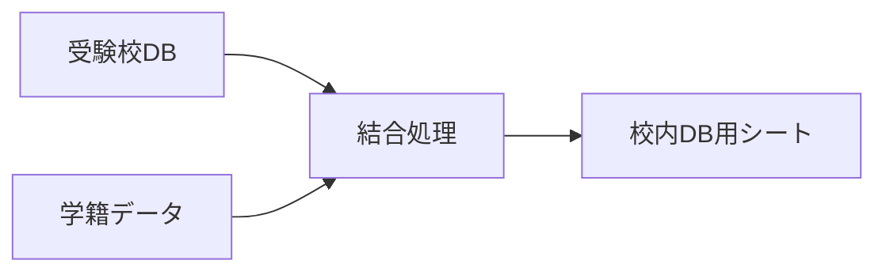
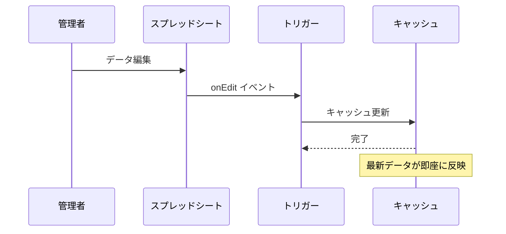

# 教員・管理者用マニュアル

[](./VERSION_CHANGES.md)
[](#)

> 本マニュアルは、受験校調査アプリの管理・運用を行う教員向けの説明書です。

---

## 📖 目次

- [ログイン・アクセス方法](#1-ログインアクセス方法)
- [Webアプリの操作（教員モード）](#2-webアプリの操作教員モード)
- [スプレッドシートの管理と設定](#3-スプレッドシートの管理と設定)
- [管理者用メニュー機能](#4-管理者用メニュー機能)
- [キャッシュ管理](#5-キャッシュ管理)
- [トラブルシューティング](#6-トラブルシューティング)
- [よくある質問（FAQ）](#7-よくある質問faq)

---

## 1. ログイン・アクセス方法

### アクセス手順

```
1. 配布されたWebアプリのURLにアクセス
2. Googleアカウントでログイン（学校指定アカウント）
3. 教員モードで画面が表示される
```

> [!IMPORTANT]
> 必ず「**職員データ**」シートに登録されているメールアドレスのアカウントでログインしてください。未登録の場合は権限エラーとなります。

---

## 2. Webアプリの操作（教員モード）

教員アカウントでアクセスすると、自動的に「**教員モード**」として画面が表示されます。

### 👨‍🎓 生徒データの確認・代理入力

| ステップ | 操作 | 説明 |
|:---:|:---|:---|
| ① | **クラス選択** | 画面上部のプルダウンから確認したいクラスを選択 |
| ② | **生徒選択** | 隣のプルダウンから生徒を選択（番号順） |
| ③ | **データ表示** | 選択した生徒の現在の登録状況が表示される |
| ④ | **代理入力** | 必要に応じてデータの追加・修正・削除が可能 |

> [!TIP]
> 変更を行った場合は、必ず画面下部の「**送信**」ボタンを押して保存してください。

### 🔄 データの自動更新

v2.3.0から、システムは以下のデータを自動的にキャッシュし、高速表示を実現しています：

- クラス一覧
- 生徒一覧
- 選択肢マスタ（試験形態、合否）
- システム設定

---

## 3. スプレッドシートの管理と設定

スプレッドシート本体でマスタデータやシステム設定を管理します。

### 📊 マスタデータの管理

> [!CAUTION]
> **シート名の変更は絶対に行わないでください**。システムが正常に動作しなくなります。

#### 学籍データ

| 列 | 項目 | 備考 |
|:---:|:---|:---|
| A | メールアドレス | **必須・重複不可** |
| B | 学年 | |
| C | クラス | |
| D | 出席番号 | |
| E | 氏名 | |

> [!NOTE]
> 学籍データを更新すると、自動的にキャッシュが更新されます（v2.3.0）。

#### 職員データ

| 列 | 項目 | 備考 |
|:---:|:---|:---|
| A | メールアドレス | **必須** - 未登録の教員はアクセス不可 |
| B | 氏名 | |

> [!NOTE]
> 職員データを更新すると、自動的にキャッシュが更新されます（v2.3.0）。

#### その他のマスタシート

| シート名 | 用途 | 自動キャッシュ |
|:---|:---|:---:|
| `大学データ` | 大学コードマスタ（Benesseインポート機能で作成可能） | - |
| `試験形態` | プルダウンに表示される試験形態リスト | ✅ |
| `合否選択肢` | プルダウンに表示される合否結果リスト | ✅ |

---

### ⚙️ システム設定（`設定`シート）

B列の値を変更することで動作を制御できます。

| 項目名 | 説明 | 設定例 |
|:---|:---|:---|
| **ページタイトル** | ブラウザタブ・ヘッダーに表示 | `2025年度 受験校調査` |
| **最大登録件数** | 生徒1人あたりの最大件数 | `20` |
| **入力許可** | 生徒の入力を制御 | `TRUE` / `FALSE` |
| **大学シリアル** | 大学データのキャッシュ更新 | 更新（任意の値に変更）すると全生徒の大学データキャッシュを強制更新します |
| **メール件名** | 調査書発行願のメール件名 | `[調査書発行願]` |
| **メール本文** | メール本文の定型文 | `調査書を添付します。印刷して提出してください。` |

> [!NOTE]
> 設定を変更すると、自動的にキャッシュが更新されます（v2.3.0）。反映には数秒かかる場合があります。

---

## 4. 管理者用メニュー機能

スプレッドシート上部のメニューバー「**管理者メニュー**」から以下の機能を実行できます。

### 4.1 📤 校内DB用データ生成



| 項目 | 内容 |
|:---|:---|
| **機能** | `受験校DB` のデータに生徒情報と大学名を結合し、分析用形式で出力 |
| **用途** | 他システムへのデータ連携、Excel集計作業の前処理 |
| **実行方法** | メニュー > 校内DB用 > 校内DB用データ生成 |

---

### 4.2 🗑️ 削除レコード完全削除

| 項目 | 内容 |
|:---|:---|
| **機能** | アプリ上で「削除」されたデータ（論理削除状態）を完全消去 |
| **確認ダイアログ** | 実行前に確認メッセージが表示されます（v2.3.0） |
| **注意** | **実行後は復元不可** - 必ずバックアップを取得してから実行 |

> [!WARNING]
> この操作は取り消しできません。実行前にスプレッドシートのコピーを作成することを強く推奨します。

---

### 4.3 📥 Benesse大学データインポート

#### 事前準備（文字コード変換）

> [!IMPORTANT]
> BenesseのCSVファイルは **Shift_JIS** エンコードです。Googleスプレッドシートで文字化けを防ぐため、**UTF-8** に変換してください。

**変換手順:**

```
1. CSVファイルを「メモ帳」で開く
2. 「ファイル」→「名前を付けて保存」を選択
3. エンコードを「UTF-8」に変更して保存
```

#### インポート手順

| ステップ | 操作 |
|:---:|:---|
| ① | 新しいシートを作成 |
| ② | UTF-8変換済みCSVデータをA1セルから貼り付け |
| ③ | そのシートを開いた状態でメニューから本機能を実行 |
| ④ | 確認ダイアログで「はい」を選択 |
| ⑤ | `大学データ` シートが自動更新される |

---

### 4.4 🔄 大学データクリア

| 項目 | 内容 |
|:---|:---|
| **機能** | `大学データ` シートの内容を全消去（ヘッダーのみ残す） |
| **用途** | 新年度更新時のマスタリセット |
| **確認ダイアログ** | 実行前に確認メッセージが表示されます |

---

### 4.5 🔄 全キャッシュ更新

| 項目 | 内容 |
|:---|:---|
| **機能** | すべてのキャッシュ対象シートのデータを強制的に再取得し、キャッシュを更新 |
| **用途** | データが古い場合や、トリガーが正しく動作していない場合の手動更新 |
| **実行方法** | メニュー > 管理者メニュー > 全キャッシュ更新 |

---

### 4.6 ⚙️ キャッシュ更新トリガー設定

| 項目 | 内容 |
|:---|:---|
| **機能** | キャッシュ自動更新のためのトリガーを一括設定 |
| **設定内容** | 編集時・変更時・1時間ごとの3種類のトリガーを自動設定 |
| **重複防止** | 既存の同名トリガーを削除してから新規作成 |
| **確認メッセージ** | 設定完了後に確認ダイアログを表示 |

**設定されるトリガー:**
- `onEdit` - シート編集時に対象シートのキャッシュを即座に更新
- `onChange` - シート構造変更時にキャッシュを更新
- `warmUpAllCache` - 1時間ごとに全キャッシュを定期更新

---

## 5. キャッシュ管理

### 5.1 自動キャッシュ更新（v2.3.0新機能）

以下のシートを編集すると、自動的にキャッシュが更新されます：

| シート名 | 更新タイミング | 有効期限 |
|:---|:---|:---|
| 設定 | 編集直後 | 6時間 |
| 合否選択肢 | 編集直後 | 6時間 |
| 受験形態選択肢 | 編集直後 | 6時間 |
| 職員データ | 編集直後 | 6時間 |
| 学籍データ | 編集直後 | 6時間 |

### 5.2 自動更新の仕組み



### 5.3 トリガーの確認方法

1. スプレッドシートの「**拡張機能**」→「**Apps Script**」を開く
2. 左側メニューの「**トリガー**」（時計アイコン）をクリック
3. 以下のトリガーが設定されていることを確認：
   - `onEdit` - 編集時
   - `onChange` - 変更時

> [!TIP]
> トリガーが設定されていない場合は、システム管理者に連絡して設定してもらってください。

### 5.4 手動キャッシュ更新

#### メニューからの実行（推奨）

「**管理者メニュー**」→「**全キャッシュ更新**」を選択すると、すべてのキャッシュ対象シートを一括更新できます。

#### Apps Scriptエディタからの実行（上級者向け）

Apps Script エディタから以下の関数を直接実行できます：

| 関数名 | 説明 |
|:---|:---|
| `warmUpCache(sheetName)` | 指定シートのキャッシュを強制更新 |
| `warmUpAllCache()` | 全対象シートのキャッシュを一括更新 |
| `setupTriggers()` | キャッシュ更新トリガーを一括設定 |

**実行方法:**
1. Apps Script エディタを開く
2. 関数を選択
3. 「実行」ボタンをクリック

---

## 6. トラブルシューティング

### よくあるエラーと対処法

| 症状 | 原因 | 対処法 |
|:---|:---|:---|
| 「権限エラー」と表示される | 職員データに未登録 | `職員データ`シートにメールアドレスを追加 |
| 生徒が表示されない | 学籍データの問題 | `学籍データ`シートの内容を確認 |
| 大学検索で候補が出ない | 大学データが空 | Benesseデータをインポート |
| PDFが送信されない | メール設定の問題 | `設定`シートのメール関連項目を確認 |
| 設定変更が反映されない | キャッシュが古い | トリガーの設定を確認、または手動で `warmUpAllCache()` を実行 |
| 選択肢が更新されない | キャッシュが古い | 数秒待つか、手動でキャッシュを更新 |

### パフォーマンス問題

| 症状 | 対処法 |
|:---|:---|
| 初回アクセスが遅い | 正常動作です。キャッシュが構築されるまで待ちましょう |
| 2回目以降も遅い | トリガーが正しく設定されているか確認 |
| データが古い | `warmUpAllCache()` を実行 |

---

## 7. よくある質問（FAQ）

<details>
<summary><strong>Q. 入力期間を制限するには？</strong></summary>

`設定`シートの「**入力許可**」を `FALSE` に変更してください。生徒はデータの閲覧のみ可能になります。

変更は自動的にキャッシュに反映されます（数秒後）。
</details>

<details>
<summary><strong>Q. 生徒のデータを一括で確認したい</strong></summary>

「**校内DB用データ生成**」機能を実行すると、全生徒のデータが`校内DB用`シートに出力されます。
</details>

<details>
<summary><strong>Q. 特定の生徒のデータを削除したい</strong></summary>

1. 教員モードで該当生徒を選択
2. 削除したい行の「削除」ボタンをクリック
3. 「送信」ボタンを押す

※ 完全削除は「削除レコード完全削除」機能を使用
</details>

<details>
<summary><strong>Q. メールが届かない</strong></summary>

1. `設定`シートのメール設定を確認
2. 迷惑メールフォルダを確認
3. Google Workspaceの送信制限に達していないか確認(1500通/日)
</details>

<details>
<summary><strong>Q. 新年度に向けてデータをリセットしたい</strong></summary>

以下の手順を推奨します：

1. 現在のスプレッドシートをコピーしてバックアップ
2. `受験校DB` シートの内容をクリア（ヘッダーは残す）
3. `学籍データ` を新年度のものに更新
4. `大学データクリア` を実行（必要に応じて）
5. Benesseデータを再インポート
6. `warmUpAllCache()` を実行してキャッシュを更新
</details>

<details>
<summary><strong>Q. トリガーの設定方法は？</strong></summary>

#### 方法1: メニューから自動設定（推奨）

1. スプレッドシートを開く
2. 「**管理者メニュー**」→「**キャッシュ更新トリガー設定**」を選択
3. 確認メッセージが表示されたら完了

これで以下のトリガーが自動設定されます：
- 編集時トリガー（`onEdit`）
- 変更時トリガー（`onChange`）
- 1時間ごとの定期更新（`warmUpAllCache`）

#### 方法2: 手動設定（上級者向け）

1. スプレッドシートから「拡張機能」→「Apps Script」を開く
2. 左側メニューの「トリガー」をクリック
3. 「トリガーを追加」で以下を設定：
   - 関数: `onEdit` / イベントタイプ: 編集時
   - 関数: `onChange` / イベントタイプ: 変更時
   - 関数: `warmUpAllCache` / イベントタイプ: 時間主導型 / 1時間ごと
</details>

<details>
<summary><strong>Q. キャッシュの有効期限は？</strong></summary>

- **サーバーサイドキャッシュ**: 6時間（設定・選択肢・学籍・職員データ）
- **クライアントサイドキャッシュ**: 24時間（大学データ）

有効期限が切れると自動的に再取得されます。
</details>

---

## 📞 お問い合わせ

技術的な問題やシステムエラーが発生した場合は、以下の情報をシステム管理者に連絡してください：

- エラーメッセージの内容
- 操作手順
- 発生日時
- 使用しているブラウザとバージョン

---

<div align="center">

📚 **関連ドキュメント**

[README](./README.md) ｜ [生徒用マニュアル](./STUDENT_MANUAL.md) ｜ [プログラム仕様書](./PROGRAM_SPECIFICATION.md)

---

*v2.3.0 - Enhanced Cache Management*

</div>
