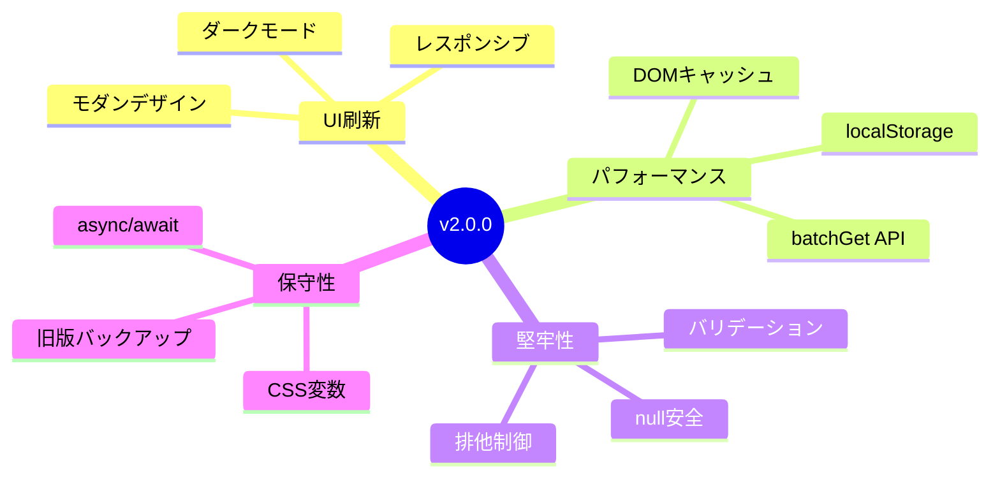
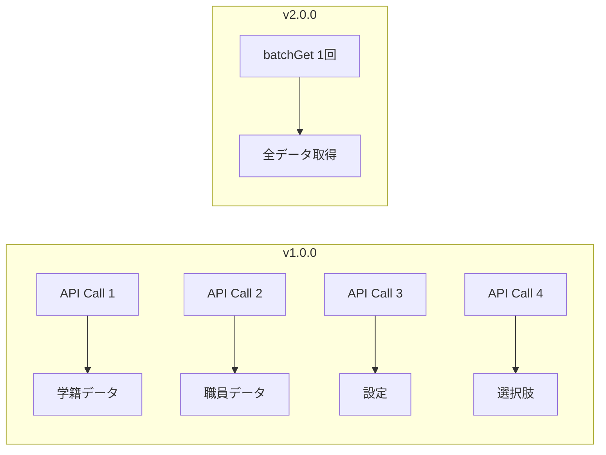

# バージョン変更履歴

[](#)
[](#)

> 本ドキュメントは、旧バージョン (v1.0.0) から新バージョン (v2.0.0) への主な変更点と改善事項をまとめたものです。

---

## 📖 目次

- [変更概要](#変更概要)
- [デザインとUI/UX](#1-デザインとuiux)
- [サーバーサイド処理](#2-サーバーサイド処理)
- [クライアントサイド処理](#3-クライアントサイド処理)
- [その他の変更](#4-その他の変更)

---

## 変更概要

v2.0.0では、以下の4つの柱で大幅な改善を実施しました。



---

## 1. デザインとUI/UX

> **対象ファイル**: `css.html`, `index.html`

### 🎨 デザインシステムの導入

| 変更内容 | 詳細 |
|:---|:---|
| **CSS変数** | 色・スペース・フォントサイズを一元管理 |
| **保守性向上** | デザイントークンによる統一的なスタイル管理 |

```css
/* 例：CSS変数の活用 */
:root {
  --color-primary: #4a90d9;
  --spacing-md: 16px;
  --font-size-base: 14px;
}
```

---

### 🌙 ダークモード対応

| 項目 | 内容 |
|:---|:---|
| **トリガー** | OSの設定に自動連動 |
| **実装方法** | `@media (prefers-color-scheme: dark)` |
| **対応範囲** | 全UIコンポーネント |

---

### 📱 レスポンシブデザインの強化

| ブレークポイント | 対象デバイス | 最適化内容 |
|:---|:---|:---|
| `> 1140px` | デスクトップ | フル機能表示 |
| `701px - 1140px` | タブレット | レイアウト調整 |
| `≤ 700px` | モバイル | **Grid表示**に変換 |

> [!TIP]
> モバイル表示時はテーブルが行列変換（Grid layout）され、縦スクロールで操作しやすくなりました。

---

### 🧩 UIコンポーネントの改善

| 変更箇所 | Before | After |
|:---|:---|:---|
| ボタン要素 | `<input type="button">` | `<button>` タグ |
| 表示切替 | `style.display` 直接操作 | `.is-hidden` クラス着脱 |
| ダイアログ | 旧デザイン | モダンデザインに刷新 |
| スピナー | 旧デザイン | アニメーション改善 |

---

## 2. サーバーサイド処理

> **対象ファイル**: `main.js`

### ⚡ パフォーマンス向上



| 改善項目 | 詳細 |
|:---|:---|
| **API最適化** | `Sheets.Spreadsheets.Values.batchGet` で1回のコールに統合 |
| **効果** | 起動時のロード時間を大幅短縮 |

---

### 🔒 データ整合性と排他制御

| 機能 | 説明 |
|:---|:---|
| **排他制御強化** | `LockService` によるロック処理を改善 |
| **サーバーバリデーション** | `validateInputData` で不正データを防止 |
| **並行アクセス対策** | データ競合リスクを低減 |

---

### 📊 データ更新ロジックの最適化

| 項目 | v1.0.0 | v2.0.0 |
|:---|:---|:---|
| 更新方式 | 全件削除 → 再登録 | **差分更新** |
| 処理効率 | △ | ◎ |
| データ整合性 | リスクあり | 安全 |

---

## 3. クライアントサイド処理

> **対象ファイル**: `script.html`

### 🚀 DOM操作の最適化

| 機能 | 説明 |
|:---|:---|
| **`cacheDomElements`** | DOM要素への参照をキャッシュ |
| **効果** | 再描画時のパフォーマンス向上 |

```javascript
// 例：DOMキャッシュの活用
const dom = {};
function cacheDomElements() {
  dom.inputTable = document.getElementById('inputTable');
  dom.sendButton = document.getElementById('sendButton');
  // ...
}
```

---

### 💾 キャッシュ機能

| 機能 | 説明 |
|:---|:---|
| **対象データ** | 大学データ (`universityCodeList`) |
| **保存先** | `localStorage` |
| **有効期限** | 24時間 |
| **効果** | 2回目以降は通信なしで検索可能 |

---

### 🛡️ 安全性と堅牢性の向上

| 改善内容 | 詳細 |
|:---|:---|
| **null安全処理** | `\|\| []`, `\|\| {}` によるフォールバック |
| **非同期処理** | `async/await` で可読性向上 |
| **エラーハンドリング** | try-catchによる適切な例外処理 |

---

## 4. その他の変更

| 項目 | 変更内容 |
|:---|:---|
| 📁 **ファイル構成** | `1.0.0/` フォルダに旧バージョンをバックアップ |
| ©️ **著作権表記** | コピーライト年号を2025年に更新 |
| 📚 **ドキュメント** | マニュアル類を整備・追加 |

---

## アップグレード時の注意

> [!WARNING]
> v1.0.0からv2.0.0へのアップグレード時は、以下の点にご注意ください。

1. **スプレッドシート構造**: 変更なし（そのまま利用可能）
2. **デプロイ**: 新しいデプロイが必要
3. **キャッシュクリア**: ユーザーにブラウザキャッシュのクリアを推奨

---

<div align="center">

📚 **関連ドキュメント**

[README](./README.md) ｜ [プログラム仕様書](./PROGRAM_SPECIFICATION.md)

</div>
